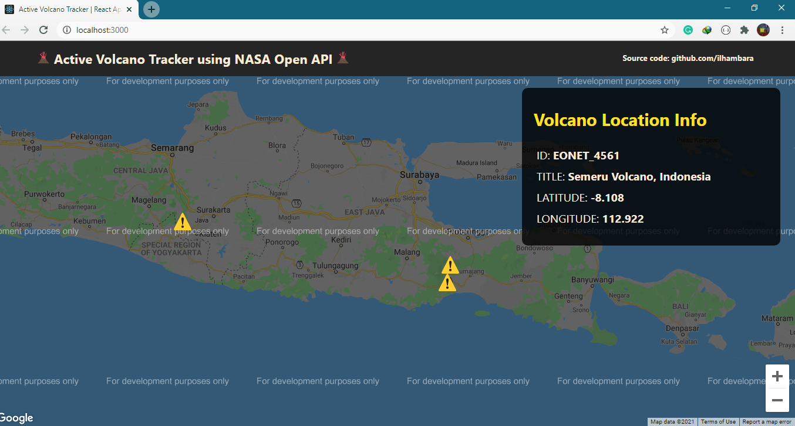

## Active Volcano Tracker using Google Maps and EONET from NASA Open API

This project shows the information about Active Volcano around the world from the start point of East Java, Indonesia. The lists of information provided are ID, Title, Latitude and Longitude.



Bootstrapped with [Create React App](https://github.com/facebook/create-react-app).

## Available Scripts

In the project directory, you can run:

### Run The Development Server

```
npm install
npm start

# Build
npm run build
or
yarn build
```

Runs the app in the development mode.\
Open [http://localhost:3000](http://localhost:3000) to view it in the browser.

The page will reload if you make edits.\
You will also see any lint errors in the console.

### APIs Resources

NASA Open APIs: https://api.nasa.gov

Google Maps API: https://developers.google.com/maps/documentation/javascript/get-api-key

